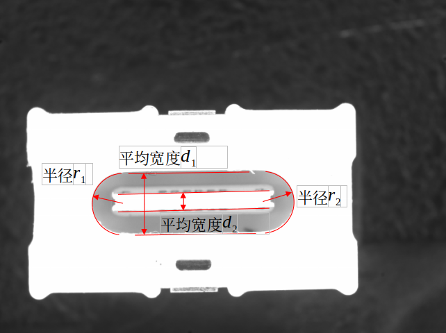

# 课题3

尺寸测量项目，计算下图所示的尺寸，要求1D测量，亚像素精度，考虑计算时间。

需要测量：

（1）r1；

（2）r2；

（3）d1；

（4）d2；

（3）分析测量重复性。

## 要求

- 编程语言 C++，不允许使用其他语言
- 需要评估算法性能
- 设计报告按模板给出
- 代码需要有可读性、模块化
- 输出需要有各测量值及其对应箭头（类似工程测量形式）

## 设计报告模板

### 1、**概述**

### 2、**课程设计任务及要求**

### 3、**算法设计**

（要求：需要说明算法原理，并附关键原理对应的有详细注释的代码）

### 4、**实验及数据分析**

（要求：需要对实验数据进行分析，得出结论性的结果）

### 5、**结论**
